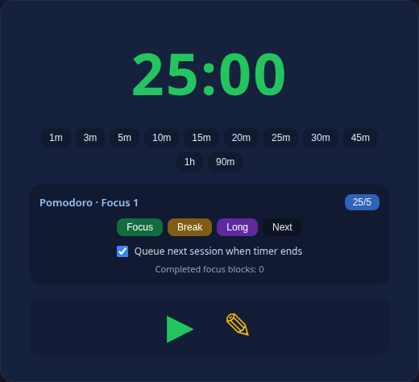
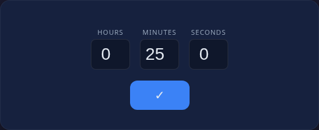

# electron-timer-app

A compact Electron + React timer with an always-on-top transparent overlay and built-in Pomodoro support.

Hotkey: `Ctrl/Cmd + 6` toggles overlay click-through mode.

## Screenshots

### Main Window — Presets & Pomodoro



### Overlay Mode — Always on Top


### Edit Mode — Set Custom Duration



## Features

- Countdown timer with hours, minutes, and seconds
- **11 quick presets**: 1m, 3m, 5m, 10m, 15m, 20m, 25m, 30m, 45m, 1h, 90m
- **Pomodoro mode** with 25/5 focus/break cycles and long break every 4th session
- Auto-queue next Pomodoro session when timer ends (toggleable)
- Manual session control: Focus, Short Break, Long Break, Next
- Completed focus block counter
- Frameless transparent always-on-top window
- Click-through overlay mode
- Alarm sound when the timer completes

## Project Setup

### Install

Requires Node.js 22.12+ and npm 10+.

```bash
npm install
```

### Development

```bash
npm run dev
```

### Quality checks

```bash
npm test
npm run lint:check
npm run typecheck
npm run build
```

### Build installers

```bash
# For Windows
npm run build:win

# For macOS
npm run build:mac

# For Linux
npm run build:linux
```

### Automated releases

Merging to `main` runs the Release workflow, which packages Windows, macOS, and Linux installers and publishes them to a GitHub Release. The workflow sets the release `tag_name` to `v${version}-${short_sha}`, for example `v1.0.0-abc1234`.

The workflow can also be started manually from GitHub Actions with `workflow_dispatch`. macOS release artifacts are unsigned and not notarized, so Gatekeeper may warn on first launch.
